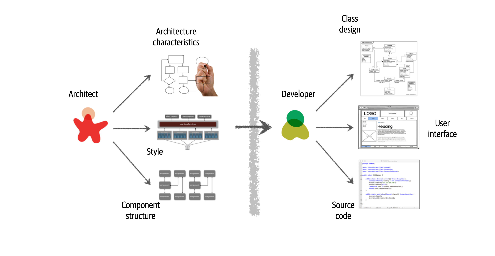

# Chapter 2 Architectural thinking


An architect see things differently from a developers' point of view

This is called architectural thinking.


## Architecture Versus Design

at architect is responsible for thinkgs like 

* analyzing business requirements to extract and define the architectural characterstics
* selecting which architecture patterns and styles would fit the problem domain,
* creating components ( the building blocks of the system)


The artifacts created from theses activites are then handed off to the development team, which is responsible for creating class diagram for each component, creating user interface screens, and developing and testing source code





Todo: add 2-3 figure


* stuff you know (tip of the ice berg)
* stuff you know you don't know
* stuff you don't know you don't know (largest portion)


...

Architects should focus on technical breadth so that thye have a larger quiver from which to draw arrows. Developers transitioning to the architect role may have to chagne the way they view knowledge acuisition. Balanceing their portfolio of knowledge regarding depth versus breadth is something every developer should consider throughout their career.


## Analyzing trade-offs

```
Architecture is the stuff you can't Google
```

Everything in architecture is a trade-off, which is why the famous answer to every architecture question in the univers is 'it depends'. while many people get increastingly annoyed at this answer, it is unfortunately true. 

it depends on the deployment environment, business drivers, company culture, budgets, timeframes, developer skill set, and ddozens of other factors. Everyone's environment, situation, and problem is different, hene why architecture is so hard.


> there are no right or wrong answers in architecture -- only trade-offs

eg: bid producer to send events to (capture, tracking, analytics service) by using an 'item bid' topic


programmings know the benefits of everthing and the trade-offs of nothing. architects need to udnerstand both.

thinking architecturally is looking at the benefits of a given solution, but also analyzing the negatives, or tarde-offs, associated with a solution.


the point ohere is that everything in software architecture has a trad-off. an advantage adn disadvantage Thinking like an architect is analyzing these trade-offs, then asking 'which is more important: extensibility or security?'


## Understanding business drivers

## balancing architecture and hands-on coding

we firmly believe that every architect should code and be able to amintain a certain level of tecnical depth. while this may seem like an easy task, it is sometimes rather difficult to accomplish.

suppose, that the architect is not able to develop code with the development team. How can a software architect still remain hands-on and maintain some level of technical depth? these are 4 fasic ways an architect can still remain hands-on at work without having to 'practice coding from home'.

Option 1:

do frequent proff-of-concepts or POCs. This practice not only requires the architect to write source code, but it also helps validate an architecture decision by traking the implementation details into account. For example, if an architect is stuck trying to make a decision between 2 caching solutions, 1 effective way to help make this decision is to develop a working example in each caching product and compare the results (sanity check??) This allows the architect to see first-hand the implementation details and the amount of effort required to develop the ull solution. it also allows the architect to better compare architectural characterstics such as scalability, performance, or overall fault tloerance of the differnt caching solutions.

Our advice when doing proff-of-concept work is that, whenever possible, the architect should write the best production-quality code they can. 

2 reasons behind this: quite often, throwaway proof-of-concept code goes into the soruce code repository, and becomes reference architectuer or guiding examples for others to follow. The last thing an architecture would wnat is for thier throwaways, sloppy code  to be a representation of their typical work.

2nd reason: by writing production-quality proof-of-concept code, the architect gets practice writing quality, well-structured code rahter than continually developing bad coding practices.


Another wayan architect can remain hands-on is to tackle some of the technical debt stories or architecture storeis ,freeing the development team up to work on the creital funtional user stores. These stories are usually low priority, so if the architect does not have the change to complete a technical debt or architecture story within a given iteration, it's not the end of hte world and generally does not impact the success of the iteration.


similarly, working on bug fixes within an iteration is another way of maintiang hand-on coding while helping the development team as well. while certainly not glamorous, this technique allow the architect t oidentify where issue and weakness may be within the code base and possibly the architecture.

leveraging automation by creating simple command-line tools and analyzers to help the development team with their day-to-day task is another greate way to maintain hands-on coding skills while making the development team more effective. lok for repetitive tasks the developmet team more peforms and automate the process. The development team will be grateful for th automation. Some examplees are automated source validator to help check for specific doding standards not found in other link tests, automated checklsits, and repetitive manual code refactoring tasks.


Automation can also be in the form of architectual analysis and fitness functions to ensure the vitatlity and compliance of the architecture. for example, an architect can writte ajva code, of ....

a final technique ot remain hands-on as an architectis to do frequent cod reviews. while the architect is nto actually writing code, at least they are involvedin the source code. Further, doing code reviews has the added benefits of being able to ensure compliance with the architecture and to seek out mentoring and coachign opportunities on the team.


coaching,?？？ 一提到这个词就肝颤


