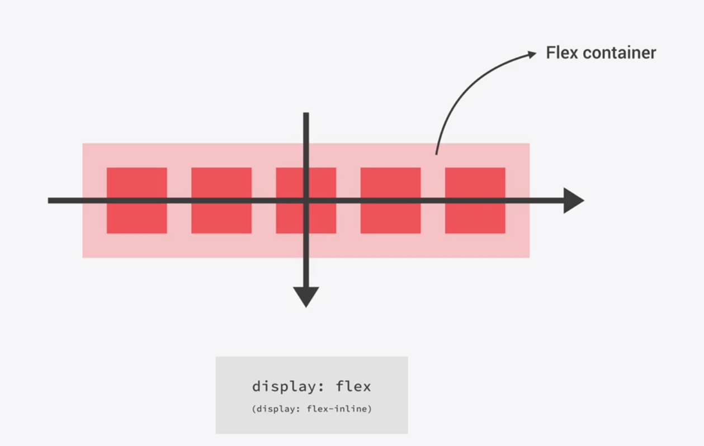

Flexbox 是一种一维的布局模型

给了flexbox的子元素,强大的空间分布和对齐的能力

flexbox 两根轴线

横向： main axis: justify-content
纵向： cross axis: align-items;

## 控制对齐
* justify-content: 主轴上所有的项目对齐
* align-items: cross轴上的所有项目对齐
* align-self: 交叉轴上单个flex item的对齐
* align-content: 多条主轴的flex item， 在交叉轴的对齐？？

> 我们会发现margin: auto属性是如何对齐flex items。 ??

交叉轴对齐：

父容器添加： display: flex属性
如果父级容器设置高度，flex item会盛满整个父级容器的高度。不管item内容多少

flex item 高度一致的原因是： align-item属性的初始值设置为stretch.

其他的flex item对齐方式：


    align-items: flex-start  flex items的开始端的对齐
    align-items: flex-end flex items的结束端对齐
    align-items: center flex items居中对齐
    align-items: stretch flex items撑满container
    align-items: baseline flex items的baseline对齐 ？？
    
### align-self 用于对齐单个flex item

```css
.box {
  display: flex;
  align-items: flex-start;
  height: 200px;
}
.box>*:first-child {
    align-self: stretch;
}
.box .selected {
    align-self: center;
}

<div class="box">
  <div>One</div>
  <div>Two</div>
  <div class="selected">Three</div>
  <div>Four</div>
</div>
      
```

可以改变其中的单个的样式

### 改变主轴方向


主轴是水平方向，交叉轴对齐则是上至下的垂直方向


flex-direction: column, 则 align-items align-self的对齐 flex item则是水平方向从左到右 ？？

### 轴对齐内容： align-content属性
要使得 align-content 生效，你需要你的flex container的height要大于flex items的可视内容。然后它会将所有的flex items打包成一块之后再对齐剩下的空间。

??

align-content 属性值
    align-content: flex-start
    align-content: flex-end
    align-content: center
    align-content: space-between
    align-content: space-around
    align-content: stretch
    align-content: space-evenly （没有在Flexbox特性中定义）


### 对齐主轴内容
justify-content 属性有和 align-content 一样的属性值：

    align-content: flex-start
    align-content: flex-end
    align-content: center
    align-content: space-between
    align-content: space-around
    align-content: stretch
    align-content: space-evenly （没有在flexbox特性中定义）


### 对齐 书写模式

```css
.box {
  direction: rtl;
  display: flex;
  justify-content: flex-end;
}
```


### alignment flex-direction

```css

.box {
  display: flex;
  flex-direction: row-reverse;
  justify-content: flex-end;
}
```

??

### 使用 auto margins 给主轴对齐定位

todo。。 i can't wait

   
   
   

