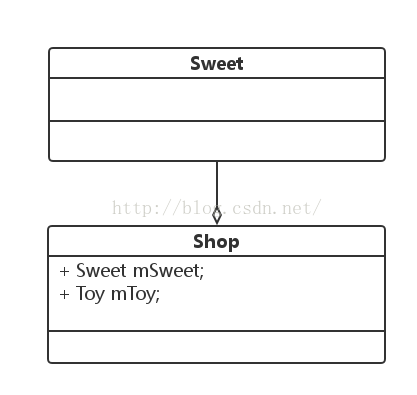

1. 继承关系
空心三角形箭头, 实线

2. 实现关系

空心三角形箭头,虚线

3. 依赖关系
A 中需要B的实例作为参数或者变量 (一般是函数的参数)

引用着类指向被饮用者,虚线的箭头

4. 关联关系

A中又B的成员变量

引用者指向被饮用者, 实现的箭头

5. 聚合

has-a

强的关联关系, 整体和可以可以具有各自的声明周期.

6. 组合

关联关系的一种特例,组合是一种整体与部分的关系contains-a, 闭聚合更强

引用者指向被引用者,尾部为实芯的菱形箭头

