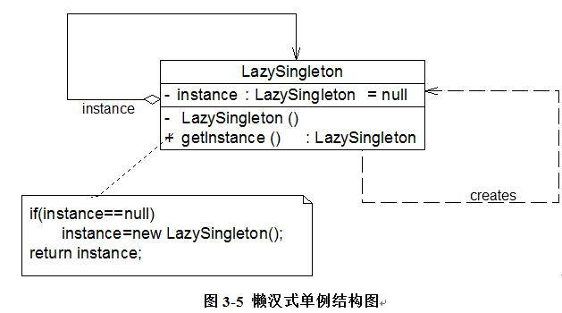

# 单利模式 动机

eg:

模拟实现windows 任务管理器

```java
class TaskManager
{
     public TaskManager() {……} //初始化窗口
     public void displayProcesses()  {……} //显示进程
     public void  displayServices() {……} //显示服务
     ……

```


1. 需要避免多次实例化这个对象

2. 如果将构造函数修改为私有函数

3. 为了保证成员变量额封装性,我们将taskManager类型的tm对象的可见性设置为private, 但外界该如何使用该成员变量呢?

```java
private static TaskManager tm = null;


public static TaskManager getInstance()
{
    if (tm == null)
    {
        tm = new TaskManager();
    }
    return tm;
}
```

## 单利模式 概念:
> 确保某个类中只有一个实例,而且自行实例化并向整个系统提供这个实例,它提供全局的访问方法.单例模式是一种对象创建型模式

三个要点:
1. 只能由一个实例
2. 必须自行创建这个实例
3. 必须自行向整个系统提供这个实例


eg:

## 负载均衡器的设计与实现

  Sunny软件公司承接了一个服务器负载均衡(Load Balance)软件的开发工作，该软件运行在一台负载均衡服务器上，可以将并发访问和数据流量分发到服务器集群中的多台设备上进行并发处理，提高系统的整体处理能力，缩短响应时间。由于集群中的服务器需要动态删减，且客户端请求需要统一分发，因此需要确保负载均衡器的唯一性，只能有一个负载均衡器来负责服务器的管理和请求的分发，否则将会带来服务器状态的不一致以及请求分配冲突等问题。如何确保负载均衡器的唯一性是该软件成功的关键。

  

```java
import java.util.*;
 
//负载均衡器LoadBalancer：单例类，真实环境下该类将非常复杂，包括大量初始化的工作和业务方法，考虑到代码的可读性和易理解性，只列出部分与模式相关的核心代码
class LoadBalancer {
	//私有静态成员变量，存储唯一实例
	private static LoadBalancer instance = null;
	//服务器集合
	private List serverList = null;
	
	//私有构造函数
	private LoadBalancer() {
		serverList = new ArrayList();
	}
	
	//公有静态成员方法，返回唯一实例
	public static LoadBalancer getLoadBalancer() {
		if (instance == null) {
			instance = new LoadBalancer();
		}
		return instance;
	}
	
	//增加服务器
	public void addServer(String server) {
		serverList.add(server);
	}
	
	//删除服务器
	public void removeServer(String server) {
		serverList.remove(server);
	}
	
	//使用Random类随机获取服务器
	public String getServer() {
		Random random = new Random();
		int i = random.nextInt(serverList.size());
		return (String)serverList.get(i);
	}
}
```

```java

class Client {
	public static void main(String args[]) {
        //创建四个LoadBalancer对象
		LoadBalancer balancer1,balancer2,balancer3,balancer4;
		balancer1 = LoadBalancer.getLoadBalancer();
		balancer2 = LoadBalancer.getLoadBalancer();
		balancer3 = LoadBalancer.getLoadBalancer();
		balancer4 = LoadBalancer.getLoadBalancer();
		
		//判断服务器负载均衡器是否相同
		if (balancer1 == balancer2 && balancer2 == balancer3 && balancer3 == balancer4) {
			System.out.println("服务器负载均衡器具有唯一性！");
		}
		
		//增加服务器
		balancer1.addServer("Server 1");
		balancer1.addServer("Server 2");
		balancer1.addServer("Server 3");
		balancer1.addServer("Server 4");
		
		//模拟客户端请求的分发
		for (int i = 0; i < 10; i++) {
            String server = balancer1.getServer();
			System.out.println("分发请求至服务器： " + server);
      }
	}
}
```

额 这里好像没有考虑并发的问题,这个例子中是成立的

## 饿汉单例与懒汉单例模式


```java


class EagerSingleton { 
    private static final EagerSingleton instance = new EagerSingleton(); 
    private EagerSingleton() { } 
 
    public static EagerSingleton getInstance() {
        return instance; 
    }   
}
```



```java

class LazySingleton { 
    private static LazySingleton instance = null; 
 
    private LazySingleton() { } 
 
    // 加入关键字 
    synchronized public static LazySingleton getInstance() { 
        if (instance == null) {
            instance = new LazySingleton(); 
        }
        return instance; 
    }
}


```

添加synchronized 进行线程锁 ??

已处理多个线程同事访问的问题.


我们无须对整个getInstance()方法进行锁定，只需对其中的代码“instance = new LazySingleton();”进行锁定即可。因此getInstance()方法可以进行如下改进：

```java
public static LazySingleton getInstance() { 
    if (instance == null) {
        synchronized (LazySingleton.class) {
            instance = new LazySingleton(); 
        }
    }
    return instance; 
}
```

假如在某一瞬间线程A和线程B都在调用getInstance()方法，此时instance对象为null值，均能通过instance == null的判断。由于实现了synchronized加锁机制，线程A进入synchronized锁定的代码中执行实例创建代码，线程B处于排队等待状态，必须等待线程A执行完毕后才可以进入synchronized锁定代码。但当A执行完毕时，线程B并不知道实例已经创建，将继续创建新的实例，导致产生多个单例对象，违背单例模式的设计思想，因此需要进行进一步改进，在synchronized中再进行一次(instance == null)判断，这种方式称为双重检查锁定(Double-Check Locking)。使用双重检查锁定实现的懒汉式单例类完整代码如下所示：

改善:

```java
class LazySingleton { 
    private volatile static LazySingleton instance = null; 
 
    private LazySingleton() { } 
 
    public static LazySingleton getInstance() { 
        //第一重判断
        if (instance == null) {
            //锁定代码块
            synchronized (LazySingleton.class) {
                //第二重判断
                if (instance == null) {
                    instance = new LazySingleton(); //创建单例实例
                }
            }
        }
        return instance; 
    }
}
```

> 注意使用了volatile 关键字

，需要在静态成员变量instance之前增加修饰符volatile，被volatile修饰的成员变量可以确保多个线程都能够正确处理，且该代码只能在JDK 1.5及以上版本中才能正确执行

两者比较:

    饿汉式单例类在类被加载时就将自己实例化，它的优点在于无须考虑多线程访问问题，可以确保实例的唯一性；从调用速度和反应时间角度来讲，由于单例对象一开始就得以创建，因此要优于懒汉式单例。但是无论系统在运行时是否需要使用该单例对象，由于在类加载时该对象就需要创建，因此从资源利用效率角度来讲，饿汉式单例不及懒汉式单例，而且在系统加载时由于需要创建饿汉式单例对象，加载时间可能会比较长。

    懒汉式单例类在第一次使用时创建，无须一直占用系统资源，实现了延迟加载，但是必须处理好多个线程同时访问的问题，特别是当单例类作为资源控制器，在实例化时必然涉及资源初始化，而资源初始化很有可能耗费大量时间，这意味着出现多线程同时首次引用此类的机率变得较大，需要通过双重检查锁定等机制进行控制，这将导致系统性能受到一定影响。


## 一种更好的单例实现模式

Initialization Demand Holder(IoDH)

我们在单例类中增加一个静态的内部类

在该内部类中创建单例对象,再将该单例对象,通过getInstance() 方法返回给外部

```java


//Initialization on Demand Holder
class Singleton {
	private Singleton() {
	}
	
	private static class HolderClass {
            private final static Singleton instance = new Singleton();
	}
	
	public static Singleton getInstance() {
	    return HolderClass.instance;
	}
	
	public static void main(String args[]) {
	    Singleton s1, s2; 
            s1 = Singleton.getInstance();
	    s2 = Singleton.getInstance();
	    System.out.println(s1==s2);
	}

```

## 真的假的??

> 由于静态单例对象没有作为Singleton的成员变量直接实例化，因此类加载时不会实例化Singleton，第一次调用getInstance()时将加载内部类HolderClass，在该内部类中定义了一个static类型的变量instance，此时会首先初始化这个成员变量，由Java虚拟机来保证其线程安全性，确保该成员变量只能初始化一次。


通过这个方法,既可以实现延迟加载,又可以保证线程安全,不影响系统的性能,

其缺点是与编程语言本身的特性相关，很多面向对象语言不支持IoDH.

## 单例模式总结

### 1. 优点

1. 对唯一实例的受控制访问.
2. 系统中只存在一个对象,可以节约系统的资源
3. 允许可变数目的实例. 既节省系统资源，又解决了单例单例对象共享过多有损性能的问题。

### 2. 缺点

1. 单例模式没有抽象层,扩展有很大的困难
2. 单例类的职责过重,一定的程度上违背了"单一职责的原则". 
3. 很多语言中,如果实例化的共享对象,长时间没有被利用,系统会垃圾回收,下次利用时会重新实例化.


### 3. 适用场景

1. 系统只需要一个实例对象
2. 客户调用类的单个实例只允许使用一个公共的访问点,除了访问点,不能通过其他的途径访问该实例

