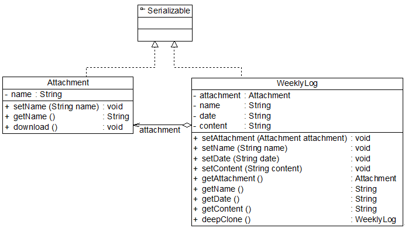
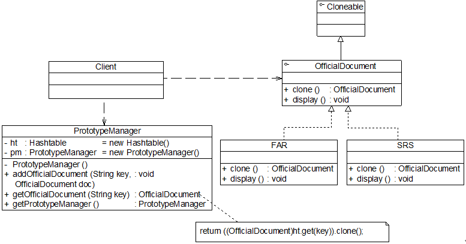

## 对象的克隆-- 原型模式

## 概述

使用原型模式时,需要首先,创建一个原型对象, 然后通过复制这个对象类创建更多的同类型的对象.


> 使用原型实例指定创建对象的种类，并且通过拷贝这些原型创建新的对象。原型模式是一种对象创建型模式。

 需要注意的是通过克隆方法所创建的对象是全新的对象，它们在内存中拥有新的地址，通常对克隆所产生的对象进行修改对原型对象不会造成任何影响，每一个克隆对象都是相互独立的。

 


 * prototype 抽象原型类: 声明克隆方法的接口,是所有具体原型的公共父类,可以是抽象类也可以是接口
 * concretePrototype: 具体原型类, 是现在抽象原型类中声明的克隆方法,克隆方法返回自己的一个克隆
 * client: 让原型对象克隆一个自己.

 ```java
class ConcretePrototype implements Prototype

{

private String  attr; //成员属性

public void  setAttr(String attr)

{

    this.attr = attr;

}

public String  getAttr()

{

    return this.attr;

}

public Prototype  clone() //克隆方法

{

    Prototype  prototype = new ConcretePrototype(); //创建新对象

    prototype.setAttr(this.attr);

    return prototype;

}

}

 ```


 ## Java 提供的clone() 方法

 需要注意的是能够实现克隆的Java类必须实现一个标识接口Cloneable，表示这个Java类支持被复制。如果一个类没有实现这个接口但是调用了clone()方法，Java编译器将抛出一个CloneNotSupportedException异常。如下代码所示：

 必须实现cloneable接口

 ```java
class ConcretePrototype implements  Cloneable

{

……

public Prototype  clone()

{

　　Object object = null;

　　try {

　　　　　object = super.clone();

　　} catch (CloneNotSupportedException exception) {

　　　　　System.err.println("Not support cloneable");

　　}

　　return (Prototype )object;

}
 ```


一般而言

1. 任何对象x,都有x.clone() != x,
2. x.clone().getClass() == x.getClass()
3. x.clone().equals(x) 成立


为了获取一份拷贝:
1. 派生类中,覆盖基本类的clone()方法,声明为public
2. 派生类的clone()方法中,调用super.clone()
3. 派生类实现cloneable 接口


...

eg: 工作周报(很多重复内容)

## 完整的解决方案


## 深克隆,浅克隆

1. 浅克隆
      在浅克隆中，如果原型对象的成员变量是值类型，将复制一份给克隆对象；如果原型对象的成员变量是引用类型，则将引用对象的地址复制一份给克隆对象，也就是说原型对象和克隆对象的成员变量指向相同的内存地址。简单来说，在浅克隆中，当对象被复制时只复制它本身和其中包含的值类型的成员变量，而引用类型的成员对象并没有复制，


```java
//附件类

class Attachment

{

       private  String name; //附件名

       public  void setName(String name)

       {

              this.name  = name;

       }

       public  String getName()

       {

              return  this.name;

       }

     public void download()

     {

            System.out.println("下载附件，文件名为" + name);

     }

}

//工作周报WeeklyLog

class WeeklyLog implements Cloneable

{

     //为了简化设计和实现，假设一份工作周报中只有一个附件对象，实际情况中可以包含多个附件，可以通过List等集合对象来实现

       private Attachment attachment;

private String name;

       private  String date;

       private  String content;

    public void setAttachment(Attachment  attachment) {

              this.attachment = attachment;

       }

       public  void setName(String name) {

              this.name  = name;

       }

       public  void setDate(String date) {

              this.date  = date;

       }

       public  void setContent(String content) {

              this.content  = content;

       }

public Attachment  getAttachment(){

              return (this.attachment);

       }

       public  String getName() {

              return  (this.name);

       }

       public  String getDate() {

              return  (this.date);

       }

       public  String getContent() {

              return  (this.content);

       }

     //使用clone()方法实现浅克隆

       public WeeklyLog clone()

       {

              Object obj = null;

              try

              {

                     obj = super.clone();

                     return (WeeklyLog)obj;

              }

              catch(CloneNotSupportedException  e)

              {

                     System.out.println("不支持复制！");

                     return null;

              }

       }

}

class Client

{

       public  static void main(String args[])

       {

              WeeklyLog  log_previous, log_new;

              log_previous  = new WeeklyLog(); //创建原型对象

              Attachment  attachment = new Attachment(); //创建附件对象

              log_previous.setAttachment(attachment);  //将附件添加到周报中

              log_new  = log_previous.clone(); //调用克隆方法创建克隆对象

              //比较周报

              System.out.println("周报是否相同？ " + (log_previous ==  log_new));

              //比较附件

              System.out.println("附件是否相同？ " +  (log_previous.getAttachment() == log_new.getAttachment()));

       }

}

```

> 周报是否相同？  false \
附件是否相同？ true


2. 深克隆


在Java语言中，如果需要实现深克隆，可以通过序列化(Serialization)等方式来实现。序列化就是将对象写到流的过程，写到流中的对象是原有对象的一个拷贝，而原对象仍然存在于内存中。

使用序列化拷贝:





序列化 代码


```java
  public WeeklyLog deepClone() throws  IOException, ClassNotFoundException, OptionalDataException

       {

              //将对象写入流中

              ByteArrayOutputStream bao=new  ByteArrayOutputStream();

              ObjectOutputStream oos=new  ObjectOutputStream(bao);

              oos.writeObject(this);

             

              //将对象从流中取出

              ByteArrayInputStream bis=new  ByteArrayInputStream(bao.toByteArray());

              ObjectInputStream ois=new  ObjectInputStream(bis);

              return  (WeeklyLog)ois.readObject();

       }

```

## 原型管理器的引入和实现

将多个原型对象存储在一个集合中供客户端使用，它是一个专门负责克隆对象的工厂，其中定义了一个集合用于存储原型对象，如果需要某个原型对象的一个克隆，可以通过复制集合中对应的原型对象来获得




```java
import java.util.*;

 

//抽象公文接口，也可定义为抽象类，提供clone()方法的实现，将业务方法声明为抽象方法

interface OfficialDocument extends  Cloneable

{

       public  OfficialDocument clone();

       public  void display();

}

 

//可行性分析报告(Feasibility Analysis Report)类

class FAR implements OfficialDocument

{

       public  OfficialDocument clone()

      {

              OfficialDocument  far = null;

              try

              {

                     far  = (OfficialDocument)super.clone();

              }

              catch(CloneNotSupportedException  e)

              {

                      System.out.println("不支持复制！");

              }

              return  far;

       }

      

       public  void display()

       {

              System.out.println("《可行性分析报告》");

       }

}

 

//软件需求规格说明书(Software Requirements Specification)类

class SRS implements OfficialDocument

{

       public  OfficialDocument clone()

       {

              OfficialDocument  srs = null;

              try

              {

                     srs  = (OfficialDocument)super.clone();

              }

              catch(CloneNotSupportedException  e)

              { 

                     System.out.println("不支持复制！");

              }

              return  srs;

       }

      

       public  void display()

       {

              System.out.println("《软件需求规格说明书》");

       }

}

 

//原型管理器（使用饿汉式单例实现）

class  PrototypeManager

{

       //定义一个Hashtable，用于存储原型对象

       private Hashtable ht=new Hashtable();

       private static PrototypeManager pm =  new PrototypeManager();

      

       //为Hashtable增加公文对象   

     private  PrototypeManager()

     {

              ht.put("far",new  FAR());

              ht.put("srs",new  SRS());               

     }

  

     //增加新的公文对象

       public void addOfficialDocument(String  key,OfficialDocument doc)

       {

              ht.put(key,doc);

       }

 

       //通过浅克隆获取新的公文对象

       public OfficialDocument  getOfficialDocument(String key)

       {

              return  ((OfficialDocument)ht.get(key)).clone();

       }

      

       public static PrototypeManager  getPrototypeManager()

       {

              return pm;

       }

}

class Client

{

       public  static void main(String args[])

       {

              //获取原型管理器对象

              PrototypeManager pm =  PrototypeManager.getPrototypeManager();  

             

              OfficialDocument  doc1,doc2,doc3,doc4;

             

              doc1  = pm.getOfficialDocument("far");

              doc1.display();

              doc2  = pm.getOfficialDocument("far");

              doc2.display();

              System.out.println(doc1  == doc2);

             

              doc3  = pm.getOfficialDocument("srs");

              doc3.display();

              doc4  = pm.getOfficialDocument("srs");

              doc4.display();

              System.out.println(doc3  == doc4);

       }

}

//client output
《可行性分析报告》

《可行性分析报告》

false

《软件需求规格说明书》

《软件需求规格说明书》

false

```

## 总结

### 1. 主要优点
(1) 当创建新的对象实例较为复杂时，使用原型模式可以简化对象的创建过程，通过复制一个已有实例可以提高新实例的创建效率。

(2) 扩展性较好，由于在原型模式中提供了抽象原型类，在客户端可以针对抽象原型类进行编程，而将具体原型类写在配置文件中，增加或减少产品类对原有系统都没有任何影响。

(3) 原型模式提供了简化的创建结构，工厂方法模式常常需要有一个与产品类等级结构相同的工厂等级结构，而原型模式就不需要这样，原型模式中产品的复制是通过封装在原型类中的克隆方法实现的，无须专门的工厂类来创建产品。

(4) 可以使用深克隆的方式保存对象的状态，使用原型模式将对象复制一份并将其状态保存起来，以便在需要的时候使用（如恢复到某一历史状态），可辅助实现撤销操作。

### 2. 主要缺点

(1) 需要为每一个类配备一个克隆方法，而且该克隆方法位于一个类的内部，当对已有的类进行改造时，需要修改源代码，违背了“开闭原则”。

(2) 在实现深克隆时需要编写较为复杂的代码，而且当对象之间存在多重的嵌套引用时，为了实现深克隆，每一层对象对应的类都必须支持深克隆，实现起来可能会比较麻烦。

### 适用场景

(1) 创建新对象成本较大（如初始化需要占用较长的时间，占用太多的CPU资源或网络资源），新的对象可以通过原型模式对已有对象进行复制来获得，如果是相似对象，则可以对其成员变量稍作修改。

(2) 如果系统要保存对象的状态，而对象的状态变化很小，或者对象本身占用内存较少时，可以使用原型模式配合备忘录模式来实现。

(3) 需要避免使用分层次的工厂类来创建分层次的对象，并且类的实例对象只有一个或很少的几个组合状态，通过复制原型对象得到新实例可能比使用构造函数创建一个新实例更加方便。
