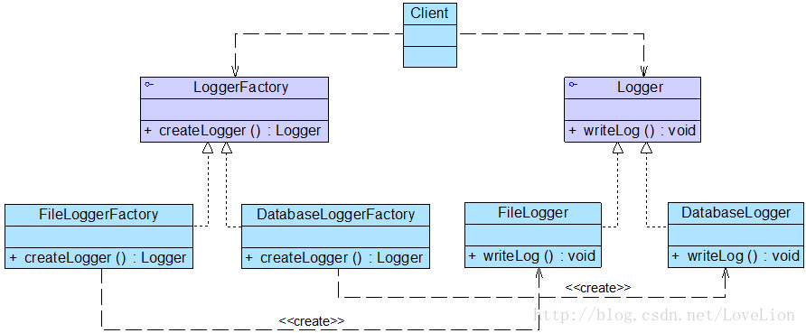

> 由于静态工厂方法通过所传入参数的不同来创建不同的产品，这必定要修改工厂类的源代码，将违背“开闭原则”，如何实现增加新产品而不影响已有代码？


举例

# 日志记录器的设计

用户可能需要更换日志的记录方式,需要提供一个灵活的方式,来选择日志的记录器.


```java


//日志记录器工厂
class LoggerFactory {
    //静态工厂方法
	public static Logger createLogger(String args) {
		if(args.equalsIgnoreCase("db")) {
			//连接数据库，代码省略
			//创建数据库日志记录器对象
			Logger logger = new DatabaseLogger(); 
			//初始化数据库日志记录器，代码省略
			return logger;
		}
		else if(args.equalsIgnoreCase("file")) {
			//创建日志文件
			//创建文件日志记录器对象
			Logger logger = new FileLogger(); 
			//初始化文件日志记录器，代码省略
			return logger;			
		}
		else {
			return null;
		}
	}

```

## 工厂方法模式概述

简单工厂只提供一个工厂类,它需要知道一个产品对象的创建细节,觉得何时实例化哪一个产品.最大的缺点是,当有新的产品加入到系统中来的饿时候,必须修改工厂类.

在工厂方法中,不再提供一个统一的工厂类来创建所有的产品对象,而是针对不同的产品,提供不用的工厂,系统提供一个与产品等级结构对应的工厂等级结构.


* project 抽象产品
* 具体产品
* 具体工厂

```java
interface Factory {
    public Product factoryMethod();
}

class ConcreteFactory implements Factory {
    public Product factoryMethod() {
        return new ConcreteProduct();
    }
}


```

## 完整的解决方案



```java

//日志记录器接口：抽象产品
interface Logger {
	public void writeLog();
}
 
//数据库日志记录器：具体产品
class DatabaseLogger implements Logger {
	public void writeLog() {
		System.out.println("数据库日志记录。");
	}
}
 
//文件日志记录器：具体产品
class FileLogger implements Logger {
	public void writeLog() {
		System.out.println("文件日志记录。");
	}
}
 
//日志记录器工厂接口：抽象工厂
interface LoggerFactory {
	public Logger createLogger();
}
 
//数据库日志记录器工厂类：具体工厂
class DatabaseLoggerFactory implements LoggerFactory {
	public Logger createLogger() {
			//连接数据库，代码省略
			//创建数据库日志记录器对象
			Logger logger = new DatabaseLogger(); 
			//初始化数据库日志记录器，代码省略
			return logger;
	}	
}
 
//文件日志记录器工厂类：具体工厂
class FileLoggerFactory implements LoggerFactory {
	public Logger createLogger() {
            //创建文件日志记录器对象
			Logger logger = new FileLogger(); 
			//创建文件，代码省略
			return logger;
	}	

// client


class Client {
	public static void main(String args[]) {
		LoggerFactory factory;
		Logger logger;
		factory = new FileLoggerFactory(); //可引入配置文件实现
		logger = factory.createLogger();
		logger.writeLog();
	}


```

## 重载的工厂方法

```java

interface LoggerFactory {
	public Logger createLogger();
	public Logger createLogger(String args);
	public Logger createLogger(Object obj);
}


class DatabaseLoggerFactory implements LoggerFactory {
	public Logger createLogger() {
			//使用默认方式连接数据库，代码省略
			Logger logger = new DatabaseLogger(); 
			//初始化数据库日志记录器，代码省略
			return logger;
	}
 
	public Logger createLogger(String args) {
			//使用参数args作为连接字符串来连接数据库，代码省略
			Logger logger = new DatabaseLogger(); 
			//初始化数据库日志记录器，代码省略
			return logger;
	}	
 
	public Logger createLogger(Object obj) {
			//使用封装在参数obj中的连接字符串来连接数据库，代码省略
			Logger logger = new DatabaseLogger(); 
			//使用封装在参数obj中的数据来初始化数据库日志记录器，代码省略
			return logger;
	}	
}
 
//其他具体工厂类代码省略

```
## 工厂方法的隐藏


```java
//改为抽象类
abstract class LoggerFactory {
    //在工厂类中直接调用日志记录器类的业务方法writeLog()
	public void writeLog() {
		Logger logger = this.createLogger();
		logger.writeLog();
	}
	
	public abstract Logger createLogger();	


class Client {
	public static void main(String args[]) {
		LoggerFactory factory;
		factory = (LoggerFactory)XMLUtil.getBean();
		factory.writeLog(); //直接使用工厂对象来调用产品对象的业务方法
	}
}

```

## 总结

### 1. 主要优点

1. client 隐藏细节
2. 基于工厂角色和产品角色多态性的设计是工厂方法模式的关键.能够让工厂确定创建何种的产品对象.
3. 加入新产品时,无须修改抽象工厂和修改产品提供的接口,客户端,以及具体工厂和具体产品,只需要添加一个新的工厂和具体产品.

符合 开闭原则


### 2. 主要缺点

1. 添加新的产品时,需要编写新的具体产品类,还可以提供与之对应的具体工厂类,系统中类的个数成对增加.
2. 考虑到系统的可扩展性,需要引入抽象层,客户端代码中均使用抽象层进行定义.
增加了系统的抽象性和和难度.

### 3. 适用场景

1. 客户端不知道它所需要的对象的类。
2. 抽象工厂类通过其子类来指定创建哪个对象。