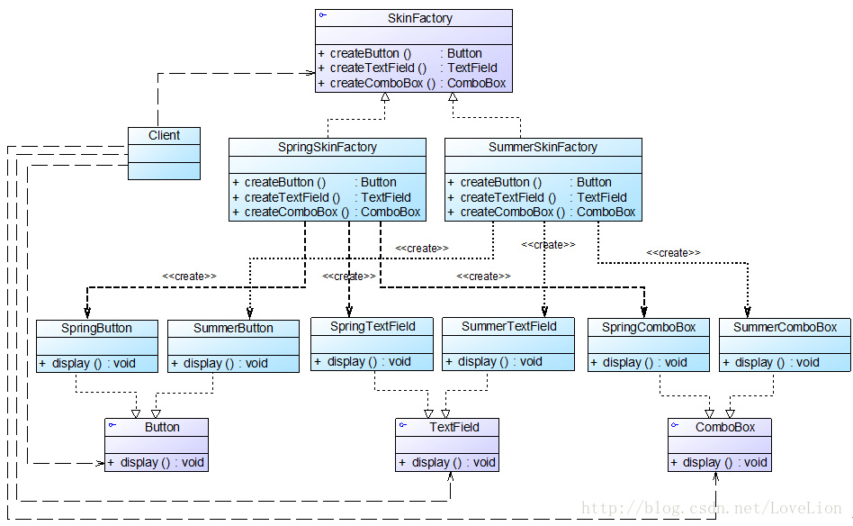

> ... 我们可以考虑将一些相关的产品组成一个产品族,由同一个工厂来统一生产


eg:

# 界面皮肤库的初始设计


设计存在问题:

1. 增加皮肤时,需要增加大量的类
2. 因此需要为每个组件都选择一个具体工厂，用户在使用时必须逐个进行设置，如果某个具体工厂选择失误将会导致界面显示混乱，虽然我们可以适当增加一些约束语句，但客户端代码和配置文件都较为复杂。

## 产品等级结构与产品族

1. 产品等级结构 (纵向?)

> 产品等级结构即产品的继承结构

如一个抽象类是电视机，其子类有海尔电视机、海信电视机、TCL电视机，则抽象电视机与具体品牌的电视机之间构成了一个产品等级结构，抽象电视机是父类，而具体品牌的电视机是其子类。

2. 产品族 (横向?)

> 产品族是指由同一个工厂生产的，位于不同产品等级结构中的一组产品


> 抽象工厂模式,是所有的工厂模式中,最为抽象和最为一般性的一种形式.
> 当一个工厂等级结构可以创建出分属于不用产品等级结构的一个产品组中的所有对象时,抽象工厂模式比工厂方法模式更加简单,更有效率


## 抽象工厂模式概述

与工厂方法模式相比,抽象工厂模式的具体工厂创建的不只是一个具体的类,而是创建一族的产品.

> 提供一个创建一系列相关或者相互依赖对象的接口.而无需指定他们具体的类.


* abastract Factory: 声明了一组用于创建一族产品的方法
* concrete factory: 实现了抽象工厂中声明的创建产品的方法,生成一组具体的产品
* abstract product: 为每种产品声明接口, 抽象产品中,声明了所有的业务方法
* concrete product: 具体产品对象

```java

abstract class AbstractFactory {
public abstract AbstractProductA createProductA(); //工厂方法一
public abstract AbstractProductB createProductB(); //工厂方法二
……
}

class ConcreteFactory1 extends AbstractFactory {
    //工厂方法一
public AbstractProductA createProductA() {
    return new ConcreteProductA1();
}
 
//工厂方法二
public AbstractProductB createProductB() {
    return new ConcreteProductB1();
}
 
……
}


```


## 完整的解决方案



```java

//在本实例中我们对代码进行了大量简化，实际使用时，界面组件的初始化代码较为复杂，还需要使用JDK中一些已有类，为了突出核心代码，在此只提供框架代码和演示输出。
//按钮接口：抽象产品
interface Button {
	public void display();
}
 
//Spring按钮类：具体产品
class SpringButton implements Button {
	public void display() {
		System.out.println("显示浅绿色按钮。");
	}
}
 
//Summer按钮类：具体产品
class SummerButton implements Button {
	public void display() {
		System.out.println("显示浅蓝色按钮。");
	}	
}
 
//文本框接口：抽象产品
interface TextField {
	public void display();
}
 
//Spring文本框类：具体产品
class SpringTextField implements TextField {
	public void display() {
		System.out.println("显示绿色边框文本框。");
	}
}
 
//Summer文本框类：具体产品
class SummerTextField implements TextField {
	public void display() {
		System.out.println("显示蓝色边框文本框。");
	}	
}
 
//组合框接口：抽象产品
interface ComboBox {
	public void display();
}
 
//Spring组合框类：具体产品
class SpringComboBox implements ComboBox {
	public void display() {
		System.out.println("显示绿色边框组合框。");
	}
}
 
//Summer组合框类：具体产品
class SummerComboBox implements ComboBox {
	public void display() {
		System.out.println("显示蓝色边框组合框。");
	}	
}
 
//界面皮肤工厂接口：抽象工厂
interface SkinFactory {
	public Button createButton();
	public TextField createTextField();
	public ComboBox createComboBox();
}
 
//Spring皮肤工厂：具体工厂
class SpringSkinFactory implements SkinFactory {
	public Button createButton() {
		return new SpringButton();
	}
 
	public TextField createTextField() {
		return new SpringTextField();
	}
 
	public ComboBox createComboBox() {
		return new SpringComboBox();
	}
}
 
//Summer皮肤工厂：具体工厂
class SummerSkinFactory implements SkinFactory {
	public Button createButton() {
		return new SummerButton();
	}
 
	public TextField createTextField() {
		return new SummerTextField();
	}
 
	public ComboBox createComboBox() {
		return new SummerComboBox();
	}
}

```

```java
// XML 工具类

import javax.xml.parsers.*;
import org.w3c.dom.*;
import org.xml.sax.SAXException;
import java.io.*;
 
public class XMLUtil {
//该方法用于从XML配置文件中提取具体类类名，并返回一个实例对象
	public static Object getBean() {
		try {
			//创建文档对象
			DocumentBuilderFactory dFactory = DocumentBuilderFactory.newInstance();
			DocumentBuilder builder = dFactory.newDocumentBuilder();
			Document doc;							
			doc = builder.parse(new File("config.xml")); 
		
			//获取包含类名的文本节点
			NodeList nl = doc.getElementsByTagName("className");
            Node classNode=nl.item(0).getFirstChild();
            String cName=classNode.getNodeValue();
            
            //通过类名生成实例对象并将其返回
            Class c=Class.forName(cName);
	  	    Object obj=c.newInstance();
            return obj;
        }   
        catch(Exception e) {
           	e.printStackTrace();
           	return null;
       	}
	}
}

/*
<?xml version="1.0"?>
<config>
	<className>SpringSkinFactory</className>
</config>


*/

// client
// 客户端不需要知道提供什么主题的组件

class Client {
	public static void main(String args[]) {
        //使用抽象层定义
		SkinFactory factory;
		Button bt;
		TextField tf;
		ComboBox cb;
		factory = (SkinFactory)XMLUtil.getBean();
		bt = factory.createButton();
		tf = factory.createTextField();
		cb = factory.createComboBox();
		bt.display();
		tf.display();
		cb.display();
	}
}

```

## 开闭原则  倾斜性


问题:

增加一个radiobutton, 不得不修改抽象工厂,以及实现类.


> 如何解决: 这个是抽象工厂模式该解决的问题. 抽象工厂模式中,增加新的产品族很方便,但是增加新的产品等级结构很麻烦,这个性质也被称为: 开闭原则的倾斜性.

1. 增加产品族

对于增加新的产品族，抽象工厂模式很好地支持了“开闭原则”，只需要增加具体产品并对应增加一个新的具体工厂，对已有代码无须做任何修改。

2. 增加新的产品等级结构

对于增加新的产品等级结构，需要修改所有的工厂角色，包括抽象工厂类，在所有的工厂类中都需要增加生产新产品的方法，违背了“开闭原则”。

正因为抽象工厂模式存在“开闭原则”的倾斜性，它以一种倾斜的方式来满足“开闭原则”，为增加新产品族提供方便，但不能为增加新产品结构提供这样的方便，因此要求设计人员在设计之初就能够全面考虑，不会在设计完成之后向系统中增加新的产品等级结构，也不会删除已有的产品等级结构，否则将会导致系统出现较大的修改，为后续维护工作带来诸多麻烦。


## 抽象工厂模式总结

### 1. 主要优点

1. 抽象工厂模式隔离了具体类的生成，使得客户并不需要知道什么被创建。
2. 当一个产品族中的多个对象被设计成一起工作时，它能够保证客户端始终只使用同一个产品族中的对象。
3.  增加新的产品族很方便，无须修改已有系统，符合“开闭原则”。

### 2. 主要缺点

增加新的产品等级结构麻烦，需要对原有系统进行较大的修改，甚至需要修改抽象层代码，这显然会带来较大的不便，违背了“开闭原则”。


## 适用场景

在以下情况下可以考虑使用抽象工厂模式：

    (1) 一个系统不应当依赖于产品类实例如何被创建、组合和表达的细节，这对于所有类型的工厂模式都是很重要的，用户无须关心对象的创建过程，将对象的创建和使用解耦。


    (2) 系统中有多于一个的产品族，而每次只使用其中某一产品族。可以通过配置文件等方式来使得用户可以动态改变产品族，也可以很方便地增加新的产品族。

    (3) 属于同一个产品族的产品将在一起使用，这一约束必须在系统的设计中体现出来。同一个产品族中的产品可以是没有任何关系的对象，但是它们都具有一些共同的约束，如同一操作系统下的按钮和文本框，按钮与文本框之间没有直接关系，但它们都是属于某一操作系统的，此时具有一个共同的约束条件：操作系统的类型。

    (4) 产品等级结构稳定，设计完成之后，不会向系统中增加新的产品等级结构或者删除已有的产品等级结构。
