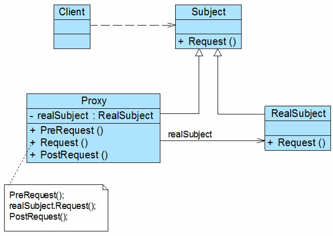
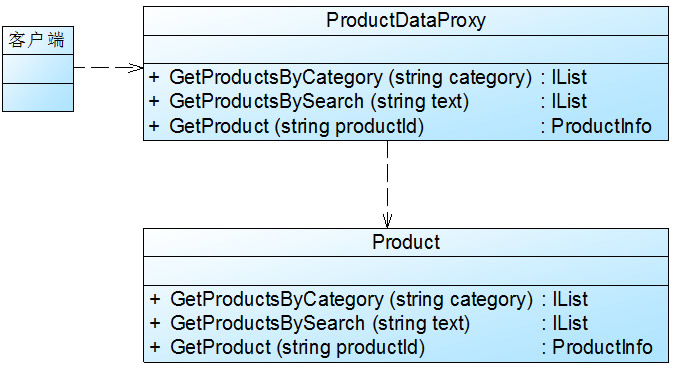

当无法直接访问某个对象或者访问某个对象存在困难时,可以通过一个代理对象间接访问,为了保证客户端使用的透明性,访问的真是对象与代理对象需要实现相同的接口.

> 给某一对象提供一个代理或者占位符,并且由代理对象来控制对原对象的访问

代理模式结构:



有多个角色

1. subject: 抽象主题角色 

2. proxy: 代理主题角色

3. realSubject: 真实主题角色


实现:

```C#

abstract class Subject {
    public abstract void Request();
}

class Proxy: Subject {
    private RealSubject realSubject = new RealSubject();

    public void PreRequest() {

    }

    public override void Request() {

        PreRequest();
        realSubject.Request(); // 调用真实的方法
        PostRequest();
    }

    public void PostRequest() {
        ……
    }
}


```

##代理种类

1. 远程代理
2. 虚拟代理
3. 保护代理
4. 缓冲代理
5. 智能引用代理


# 举例

```
    某软件公司承接了某信息咨询公司的收费商务信息查询系统的开发任务，该系统的基本需求如下：

       (1) 在进行商务信息查询之前用户需要通过身份验证，只有合法用户才能够使用该查询系统；

       (2) 在进行商务信息查询时系统需要记录查询日志，以便根据查询次数收取查询费用。

       该软件公司开发人员已完成了商务信息查询模块的开发任务，现希望能够以一种松耦合的方式向原有系统增加身份验证和日志记录功能，客户端代码可以无区别地对待原始的商务信息查询模块和增加新功能之后的商务信息查询模块，而且可能在将来还要在该信息查询模块中增加一些新的功能。

       试使用代理模式设计并实现该收费商务信息查询系统。
```

流程图：


代理对象能够实现
* 身份验证
* 日志记录


实现：

```C#

namespace ProxySample
{
    class AccessValidator
    {
        public bool Validate(string userId) {
            ...
            // validate login
        }
    }

    class Logger
    {
        public void Log(string userId) {
            ...
            // do log
        }
    }

    interface Searcher {
        string DoSearch(string userId, string keyword);
    }

    class RealSearcher: Searcher {
        public string DoSearch(string userId, string keyword) {
            // 实现．．
        }
    }

    class proxySearcher: Searcher {
        private RealSearcher searcher = new RealSearcher();
        private AccessValidator validator;
        private Logger logger;

        public string DoSearch(string usreId, string keyword) {
            // validate
            if(this.Validate(userId)) {
                string result = searcher.DoSearch(userId, keyword);
                this.Log(userId);
                return result;
            } else {
                return null;
            }
        }

        public bool Validate(string userId) {
            ...
        }

        public void Log(string userId) {
            ...
        }
    }
}

// .. 反射生成 App.config
// <?xml version="1.0" encoding="utf-8" ?>
// <configuration>
//   <appSettings>
//     <add key="proxy" value="ProxySample.ProxySearcher"/>
//   </appSettings>
// </configuration>

// 调用
 class Program
    {
        static void Main(string[] args)
        {
            //读取配置文件
            string proxy = ConfigurationManager.AppSettings["proxy"];

            //反射生成对象，针对抽象编程，客户端无须分辨真实主题类和代理类
            Searcher searcher;
            searcher = (Searcher)Assembly.Load("ProxySample").CreateInstance(proxy);

            String result = searcher.DoSearch("杨过", "玉女心经");
            Console.Read();
        }
    }

```

## 远程代理


## 虚拟代理

对于一些占用系统资源比较多的或者加载时间比较长的对象,可以设值一个虚拟的代理,在真实的对象创建之前,虚拟代理扮演的真实对象的替身,而当真的对象创建以后,虚拟代理将用户的请求转发给真实的对象..

    (1) 由于对象本身的复杂性或者网络等原因导致一个对象需要较长的加载时间，此时可以用一个加载时间相对较短的代理对象来代表真实对象。通常在实现时可以结合多线程技术，一个线程用于显示代理对象，其他线程用于加载真实对象。这种虚拟代理模式可以应用在程序启动的时候，由于创建代理对象在时间和处理复杂度上要少于创建真实对象，因此，在程序启动时，可以用代理对象代替真实对象初始化，大大加速了系统的启动时间。当需要使用真实对象时，再通过代理对象来引用，而此时真实对象可能已经成功加载完毕，可以缩短用户的等待时间。

    (2) 当一个对象的加载十分耗费系统资源的时候，也非常适合使用虚拟代理。虚拟代理可以让那些占用大量内存或处理起来非常复杂的对象推迟到使用它们的时候才创建，而在此之前用一个相对来说占用资源较少的代理对象来代表真实对象，再通过代理对象来引用真实对象。为了节省内存，在第一次引用真实对象时再创建对象，并且该对象可被多次重用，在以后每次访问时需要检测所需对象是否已经被创建，因此在访问该对象时需要进行存在性检测，这需要消耗一定的系统时间，但是可以节省内存空间，这是一种用时间换取空间的做法。

于是想到了神秘海域２．．．．

## 缓冲代理

相当于缓存一些结果，避免重复执行相同的操作



```C#

public static class ProductDataProxy
{
    private static readonly int productTimeout = int.Parse(ConfigurationManager.AppSettings ["ProductCacheDuration"]);
    private static readonly bool enableCaching = bool.Parse(ConfigurationManager. AppSettings["EnableCaching"]); 

    public static IList GetProductsByCategory(string category)
    {        
        Product product = new Product();

        //如果缓存被禁用，则直接通过product对象来获取数据
         if (!enableCaching)
        {
            return product.GetProductsByCategory(category);
        }

        string key = "product_by_category_" + category;
        //从缓存中获取数据
         IList data = (IList )HttpRuntime.Cache[key];  

        //如果缓存中没有数据则执行如下代码
          if (data == null)
        {            
          data = product.GetProductsByCategory(category);            
          //通过工厂创建AggregateCacheDependency对象
            AggregateCacheDependency cd = DependencyFacade.GetProductDependency (); 
          //将数据存储在缓存中，并添加必要的AggregateCacheDependency对象
            HttpRuntime.Cache.Add(key, data, cd, DateTime.Now.AddHours(product Timeout), Cache.NoSlidingExpiration, CacheItemPriority.High, null); 
        }
        return data;
    }

```

## 总结

### 优点

１．　降低系统耦合度
２．　客户端可以针对抽象主题角色进行编程，增加和更换代理类无需修改源代码，符合开闭原则，有良好的灵活性和扩展性

       (1) 远程代理为位于两个不同地址空间对象的访问提供了一种实现机制，可以将一些消耗资源较多的对象和操作移至性能更好的计算机上，提高系统的整体运行效率。

           (2) 虚拟代理通过一个消耗资源较少的对象来代表一个消耗资源较多的对象，可以在一定程度上节省系统的运行开销。

           (3) 缓冲代理为某一个操作的结果提供临时的缓存存储空间，以便在后续使用中能够共享这些结果，优化系统性能，缩短执行时间。

           (4) 保护代理可以控制对一个对象的访问权限，为不同用户提供不同级别的使用权限。

### 缺点

１．　有可能请求时间变长
２．　远程代理的实现比较复杂

### 适用场景..

           (1) 当客户端对象需要访问远程主机中的对象时可以使用远程代理。

           (2) 当需要用一个消耗资源较少的对象来代表一个消耗资源较多的对象，从而降低系统开销、缩短运行时间时可以使用虚拟代理，例如一个对象需要很长时间才能完成加载时。

           (3) 当需要为某一个被频繁访问的操作结果提供一个临时存储空间，以供多个客户端共享访问这些结果时可以使用缓冲代理。通过使用缓冲代理，系统无须在客户端每一次访问时都重新执行操作，只需直接从临时缓冲区获取操作结果即可。

           (4) 当需要控制对一个对象的访问，为不同用户提供不同级别的访问权限时可以使用保护代理。

           (5) 当需要为一个对象的访问（引用）提供一些额外的操作时可以使用智能引用代理。`