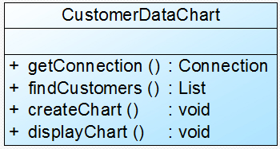
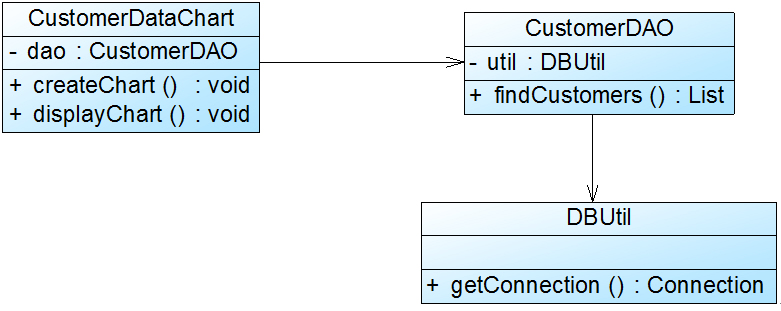

| 设计原则的名称 | 定义 | 频率|
| -----| -----| ----:|
| 单一职责原则 | 一个类只负责一个功能领域中相应的职责|4|
| 开闭原则| 软件实体应对扩展开放，对修改关闭|5|
|李氏代换原则|所有引用基类对象的地方，能够透明的使用其子类的对象|5|
|依赖倒转原则|抽象不应该依赖于细节， 细节应该依赖于抽象|5|
|接口隔离原则|使用多个专门的接口，而不使用大一的总接口|2|
|合成复用原则| 尽量使用对象组合， 而不是继承来达到复用的目的|4|
|第一特法则|一个软件实体应当尽可能的少地与其他实体发生相互作用|3|


## 单一职责原则
**一个类只负责一个功能领域中的相应职责，或者可以定义为：就一个类而言，应该只有一个引起它变化的原因**

它是实现高内聚， 低耦合的知道方针，是最简单又最难运用的原则。

举例：




这个类承担了太多的职责，包含了数据库的相关方法，又包含了生成表，显示表的功能，拆分:

1. DBUtil
2. CustomerDAO
3. CustomerDataChart




## 开闭原则
**一个软件实体，应该对扩展开放，对修改关闭。软件实体应该在不修改原有代码的情况下，进行扩展**

随着软件的规模越来越大，软件寿命越来越长，软件维护的成本越来越高，设计满足开闭原则的软件系统也变得越来越重要。

**抽象化是开闭原则的关键**


``` java
if (type.equals("pie")) {
    PieChart chart = new PieChart();
    chart.display();
}
else if (type.equals("bar")) {
    BarChart chart = new BarChart();
    chart.display();
}
```

如果添加折线图，那么需要修改display()代码，违反了开闭原则

修改：

1. 增加一个抽象类AbstractChart
2. chartDisplay针对抽象的类进行编程


在 charDisplay的display()方法中，调用chart对象的display()方法，显示图表。
如果需要增加新的图表，只需要集成abstractchart类


注意：
xml, properties等格式的配置文件是纯文本的文件，可以直接通过VI编辑器编辑，无需变异，因此对配置文件的修改不当做对源码的修改，即可以认为是符合开闭原则的系统

## 李氏代换原则
**所有引用父类的地方必须能够透明的使用其子类的对象**

。。是实现开闭原则的重要方式之一，由于使用基类对象的放都可以使用子类对象，因此在**程序中尽量使用基类类型来对对象进行定义，而在运行时再确定其子类类型，用子类对象来替换父类对象**

1. 子类的所有方法必须在父类中生命，或者子类必须实现父类声明的所有方法
2. 尽量把父类设计为抽象类或者接口，让子类集成父类或者实现父类声明的方法。

举例：


应该使用抽象的客户类


## 依赖倒转
**抽象不应该依赖于细节，细节应当依赖于抽象。换而言之，应该针对接口编程，而不应该针对实现编程**

依赖反转原则要求我们在程序代码中传递参数时或在关联关系中，尽量引用层次高的抽象类型，即使用接口和抽象类进行变量类型的声明、参数类型声明、方法返回类型声明，以及数据类型的转换等，而不要用具体类型来做这些事情。

在引入抽象层以后，系统将具有很好的灵活性，程序中尽量使用抽象层进行编程，而将具体类写在配置文件中，这样一来，系统如果发生变化，只需要针对抽象层进行扩展，并且修改配置文件，而无须修改原有系统的源代码。在不修改的情况下来扩展系统的功能，满足开闭原则的要求。

我们针对抽象层编程是，将具体类，通过依赖注入， DI的方式注入到其他对象当中。

常用的注入方式有三种，

1. 构造注入
2. 设值注入（setter）
3. 接口注入

1. 构造函数传入具体的对象
2. setter方法
3. 接口声明的业务方法来传入具体类的对象。这些方法在定义时使用的是抽象类型，运行时再传入具体类型的对象。

举例：


dao层针对具体数据转换类编程，因此不用的类型的时候，需要修改dao的源码

通过引入抽象的数据转换类来解决问题


在大多数情况下，这三个设计原则会同时出现，开闭原则是目标，里氏代换原则是基础，依赖倒转原则是手段，它们相辅相成，相互补充，目标一致，只是分析问题时所站角度不同而已。


## 接口隔离
使用多个专门的接口，而不使用单一的总结口，客户端不应该依赖那些它不需要的接口

 根据接口隔离原则，当一个接口太大时，我们需要将它分割成一些更细小的接口，使用该接口的客户端仅需知道与之相关的方法即可。每一个接口应该承担一种相对独立的角色，不干不该干的事，该干的事都要干。
 
这里的接口通常又两种含义：
1. 一种是指一个类型所具有的方法特征的集合
2. 某种语言具体的接口大国医，有严格的定义和结构， 比如java interface


一个接口做了很多事情

例如如果一个具体的数据显示类无须进行数据转换（源文件本身就是XML格式），但由于实现了该接口，将不得不实现其中声明的transformToXML()方法（至少需要提供一个空实现）；如果需要创建和显示图表，除了需实现与图表相关的方法外，还需要实现创建和显示文字报表的方法，否则程序编译时将报错。

接口承担了太多的职责，一方面导致该接口的实现类庞大，在不同的实现类中都不得不实现接口中定义的所有方法，灵活性较差。如果出现大量的空方法，将导致系统出现大量无用的代码。

另一方面，由于方法了接口，客户端看到了不该看到的方法，没有为客户端定制接口。


在使用接口隔离原则的时候，我们需要注意控制接口的粒度，不能太小，如果太小会导致系统中的接口泛滥；

接口不能太大，太大将违背接口隔离原则。


## 合成复用原则
composite reuse principly, CRP: 尽量使用对象组合，而不是继承类达到复用的目的

在一个新的对象里，通过关联关系（组合关系，聚合关系）来使用一些已有的对象，使之成为新的对象的一部分. 新对象通过委派调用已有对象的方法达到复用的原则.


复用时要尽量使用组合/聚合关系（关联关系），少用继承。


可以通过两种方法在不同的环境中复用已有的设计和实现，即通过组合/聚合关系或通过继承，但首先应该考虑使用组合/聚合，组合/聚合可以使系统更加灵活，降低类与类之间的耦合度，一个类的变化对其他类造成的影响相对较少；其次才考虑继承，在使用继承时，需要严格遵循里氏代换原则，有效使用继承会有助于对问题的理解，降低复杂度，而滥用继承反而会增加系统构建和维护的难度以及系统的复杂度，因此需要慎重使用继承复用。

> 通过继承来进行复用的主要问题在于继承复用会破坏系统的封装性，因为继承会将基类的实现细节暴露给子类，由于基类的内部细节通常对子类来说是可见的，所以这种复用又称“白箱”复用，如果基类发生改变，那么子类的实现也不得不发生改变；从基类继承而来的实现是静态的，不可能在运行时发生改变，没有足够的灵活性；而且继承只能在有限的环境中使用（如类没有声明为不能被继承）。

由于组合或聚合关系可以将已有的对象（也可称为成员对象）纳入到新对象中，使之成为新对象的一部分，因此新对象可以调用已有对象的功能，这样做可以使得成员对象的内部实现细节对于新对象不可见，所以这种复用又称为“黑箱”复用，相对继承关系而言，其耦合度相对较低，成员对象的变化对新对象的影响不大，可以在新对象中根据实际需要有选择性地调用成员对象的操作；合成复用可以在运行时动态进行，新对象可以动态地引用与成员对象类型相同的其他对象。

"has-a"使用组合或者聚合,如果是"is-A" 可以使用继承.

"Is-A"是严格的分类学意义上的定义，意思是一个类是另一个类的"一种"；而"Has-A"则不同，它表示某一个角色具有某一项责任


因此需要增加一个新的OracleDBUtil类来连接Oracle数据库，由于在初始设计方案中CustomerDAO和DBUtil之间是继承关系，因此在更换数据库连接方式时需要修改CustomerDAO类的源代码，将CustomerDAO作为OracleDBUtil的子类，这将违反开闭原则。

使用合成复用原则对其进行重构.


CustomerDAO和DBUtil之间的关系由继承关系变为关联关系，采用依赖注入的方式将DBUtil对象注入到CustomerDAO中，可以使用构造注入，也可以使用Setter注入。

如果需要对DBUtil的功能进行扩展，可以通过其子类来实现，如通过子类OracleDBUtil来连接Oracle数据库。由于CustomerDAO针对DBUtil编程，根据里氏代换原则，DBUtil子类的对象可以覆盖DBUtil对象，只需在CustomerDAO中注入子类对象即可使用子类所扩展的方法。例如在CustomerDAO中注入OracleDBUtil对象，即可实现Oracle数据库连接，原有代码无须进行修改，而且还可以很灵活地增加新的数据库连接方式。


## 合成复用原则 (CRP composite reuse principle)

通过继承来进行复用的主要问题在于继承复用会破坏系统的封装性,因为继承会将实现的细节暴露给子类.，如果基类发生改变，那么子类的实现也不得不发生改变；从基类继承而来的实现是静态的，不可能在运行时发生改变，没有足够的灵活性；而且继承只能在有限的环境中使用（如类没有声明为不能被继承）。


由于组合或举个关系可以将已有的对象纳入新的对象中,是指成为新对象的一部分,因此新对象可以调用已有的功能,这样可以使得成员对象内部实现细节对于新的对象不可见,"黑箱"复用,相对继承关系,其耦合度较低,成员对象的变化对新的对象影响不打,可以在新的对象中根据实际需要,有选择的调用成员对象的操作.


举例:


CustomerDAO 继承 DBUtil 类,不够灵活,实现时应该多用关联,少用继承.


采用依赖注入的方式,将DBUtil对象,注入到customerDAO中,可以使用构造注入,也可以使用setting注入.


## 迪米特法则

少只是原则(leastknowledge principle, LKP)

迪米特法则可以降低系统的耦合度,使类与类之间保持松耦合的关系

* 不要和陌生人说话,只于你的朋友通信等等.

朋友包括一下基类:
* 当前对象本身(this)
* 以参数形式传入到当前对象方法中的对象
* 当前对象的成员对象
* 如果当前对象的成员对象是一个集合,那么集合中的原则也都是朋友
* 当前对象所创建的对象

迪米特法则要求:
尽量减少对象之间的交互,如果两个对象之间不必彼此直接通信,那么两个对象就不应当放生热河直接的相互作用,如果其中一个的对象需要调用另一个对象的某一个方法,那么可以通过第三者转发这个调用

类之间的耦合度月底,越有利于复用
每个类都应当尽量降低其成员变量和函数的访问权限;类的设计上,只要有可能,一个类型应当设计成不变类;在对其他类的引用上,一个对象对其他对象的引用应当降到最低


举例:


某些界面控件之间存在复杂的交互关系，一个控件事件的触发将导致多个其他界面控件产生响应，例如，当一个按钮(Button)被单击时，对应的列表框(List)、组合框(ComboBox)、文本框(TextBox)、文本标签(Label)等都将发生改变，在初始设计方案中，界面控件之间的交互关系可简化为如图1所示结构

这个例子中,引入一个专门用于控制界面交互的中间类(mediator) 降低界面控制之间的耦合度.


