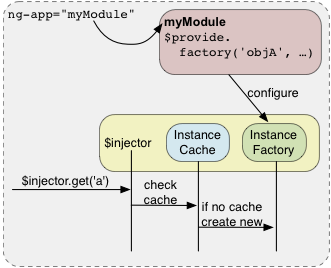

# DP

it is a software design pattern deals with how componenets get hold of their dependencies

## using DI

* Services, directives, filters, and animations are defined by an injectable factory method or constructor function, and can be injected with "services", "values", and "constants" as dependencies.

* Controllers are defined by a constructor function, and can be injected with any sevice, values as dependencies.

* run method acceptas a function, which ca nbe injected with service, values, and constants as dependeneies

* config method accpts a function, which can be injected with providers and constants as dependencies.
* provider method can only be injected with other providers.

    However, only those that have been registered beforehand can be injected. This is different from services, where the order of registration does not matter.

## Factory Methods
The way you define a directive, service, or filter is with a factory function. The factory methods are registered with modules. The recommended way of declaring factories is:
recommend:

```js

angular.module('myModule', [])
.factory('serviceId', ['depService', function(depService) {
    ...
}])
.directive('directiveName', ['depService', function(depService) {
    ...
}])
.filter('filterName', ['depService', function() {
    ...
}]);

```

## Module Methods
We can specify function to run at configuration and run time for a module by calling the config, and run methods.

```js

angular.module('myModule', [])
.config(['depProvider', function(depProvider) {
    ...
}])
.run(['depService', function(depService) {
    ...
}]);

```


## Controllers
controllers are classes or constructor functions that are responsible for providing the application behavior that suppports the eclarative markup in the template.

```js
someMoudle.controleer("MyController", ['$scope', 'dep1', 'dep2', function($scope, dep1, dep2) {
    ....
    $scope.aMethod = function() {

    }
}])

```


* $scope: Controllers are associated with an element in the DOM and so are provided with access to the scope. Other components (like services) only have access to the $rootScope service.
* resolves: If a controller is instantiated as part of a route, then any values that are resolved as part of the route are made available for injection into the controller. ???

## Dependency Annotation
Angluarjs invokes certain functions via the injector. need to annotate theses functions so that the injector knows what services to inject into the function. there are three ways of annotatin code

* using inline array annotation(preferred)
* using $inject
* implicitly from the function parameter names


### Inline array annotation
```js
someModule.controller("MyController", ['$scope', 'greeter', function($scope, greeter) {
    ...
}])
```


### Inject proterty annotation


```js

var MyController = function($scope, greeter) {
    ...
}

MyController.$inject = ['$scope', 'greeter'];

somemodule.controller('MyController', MyController);

```

### Implicit annotataion
assume that the functions parameters names are the name of the dependencies.


```js
someModule.controller('MyController', function($scope, greeter) {
  // ...
});
```


## Why DI?

There are only three ways a component (object or function) can get a hold of its dependencies:

* The component can create the dependency, typically using the new operator.
* The component can look up the dependency, by referring to a global variable.
* The component can have the dependency passed to it where it is needed.

The first two options of creating or looking up dependencies are not optimal because they hard code the dependency to the component. This makes it difficult, if not impossible, to modify the dependencies. This is especially problematic in tests, where it is often desirable to provide mock dependencies for test isolation.



