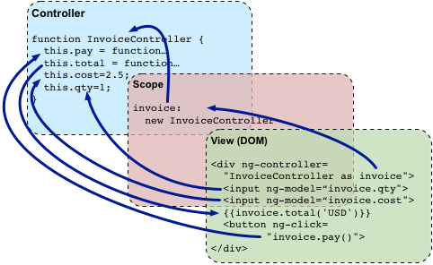

# Zen Angularjs

* decouple DOM manipulation from app logic.
* regarding app testing as equal in importance to app writing
* decouple client side from server side
* framework guid developers
* make trivial and difficult tasks possible.


# Conceptual overview

## Data binding


### 1. Directives

```html

<div ng-app ng-init="qty=1;cost=2">
  <b>Invoice:</b>
  <div>
    Quantity: <input type="number" min="0" ng-model="qty">
  </div>
  <div>
    Costs: <input type="number" min="0" ng-model="cost">
  </div>
  <div>
    <b>Total:</b> {{qty * cost | currency}}
  </div>
</div>

```

model:

{
    cost: 1,
    qty: 2.5
}

DOM: 
ng-model

data binding: model -- DOM


> in angularjs, the only place where an application should access the DOM is within directives.\
    if you need to access the DOM directly you should write a custom directive for this.


### 2. Double curly braces

{{ expression | filter }}

## Adding UI Logic: Controllers

``` js
angular.module('invoice1', [])
.controller('InvoiceController', function InvoiceController() {
    this.qty = 1;
    this.cost = 2;
    this.inCurr = 'EUR';
    this.currencies = ['USD', 'EUR', 'CNY'];
    this.usdToForeignRates = {
        USDL 1,
        EUR: 0.74,
        CNY: 6.09
    };

    this.total = function total(outCurr) {
        return this.convertCurrency(this.qty * this.cost, this.inCurr, outCurr);

    };

    this.convertCurrency = function convertCurrency(amount, inCurr, outCurr) {
        return amount * this.usdToForeignRates[outCurr] / this.usdToForeignRates[inCurr];
    }

    this.pay = function pay() {
        window.alert("thanks");
    }
    
})
```

```html


<div ng-app="invoice1" ng-controller="InvoiceController as invoice">
  <b>Invoice:</b>
  <div>
    Quantity: <input type="number" min="0" ng-model="invoice.qty" required >
  </div>
  <div>
    Costs: <input type="number" min="0" ng-model="invoice.cost" required >
    <select ng-model="invoice.inCurr">
      <option ng-repeat="c in invoice.currencies">{{c}}</option>
    </select>
  </div>
  <div>
    <b>Total:</b>
    <span ng-repeat="c in invoice.currencies">
      {{invoice.total(c) | currency:c}}
    </span><br>
    <button class="btn" ng-click="invoice.pay()">Pay</button>
  </div>
</div>

```


This directive tells AngularJS that the new InvoiceController is reponsible for the element with the directive and all of the element's children.

The syntax InoiceController as invoice tells angularjs to instantiate the controller and save it in the variable invoice in the current scope




## View-independent business logic: Services

when the application grow it is a good practice to move view-independent logic from the controller into a service, so it can be reused by other parts of the application as well.

let's refactor example and move the currency conversion into a service in another file

```js

// finance2.js
angular.module('finance2', [])
.factory('currentcyConverter', function() {
    var currencies = ['USD', "EUR", 'CNY']
      var usdToForeignRates = {
        USD: 1,
        EUR: 0.74,
        CNY: 6.09
    };
    var convert = function(amount, inCurr, outCurr) {
        return amount * usdToForeignRates[outCurr] / usdToForeignRates[inCurr];
    };
    return {
        currentcies: currencies,
        convert: convert
    }
})

// invoice2.js
angular.module('invoice2', ['finance2'])
.controller('InvoiceController', ['currencyConverter', function InvoiceController() {
  this.qty = 1;
  this.cost = 2;
  this.inCurr = 'EUR';
  this.currencies = currencyConverter.currencies;

  this.total = function total(outCurr) {
    return currencyConverter.convert(this.qty * this.cost, this.inCurr, outCurr);
  };
  this.pay = function pay() {
    window.alert('Thanks!');
  };
}]);

```

```html


<div ng-app="invoice2" ng-controller="InvoiceController as invoice">
  <b>Invoice:</b>
  <div>
    Quantity: <input type="number" min="0" ng-model="invoice.qty" required >
  </div>
  <div>
    Costs: <input type="number" min="0" ng-model="invoice.cost" required >
    <select ng-model="invoice.inCurr">
      <option ng-repeat="c in invoice.currencies">{{c}}</option>
    </select>
  </div>
  <div>
    <b>Total:</b>
    <span ng-repeat="c in invoice.currencies">
      {{invoice.total(c) | currency:c}}
    </span><br>
    <button class="btn" ng-click="invoice.pay()">Pay</button>
  </div>
</div>


```
in the example above, the template contains the directive ng-app="invoice2", this tells angularjs to use the invoice2 module as the main module for  the application.


This is where Dependency Injection comes into play. Dependency Injection (DI) is a software design pattern that deals with how objects and functions get created and how they get a hold of their dependencies. 

Everything within AngularJS (directives, filters, controllers, services, ...) is created and wired using dependency injection. Within AngularJS, the DI container is called the **injector**.
