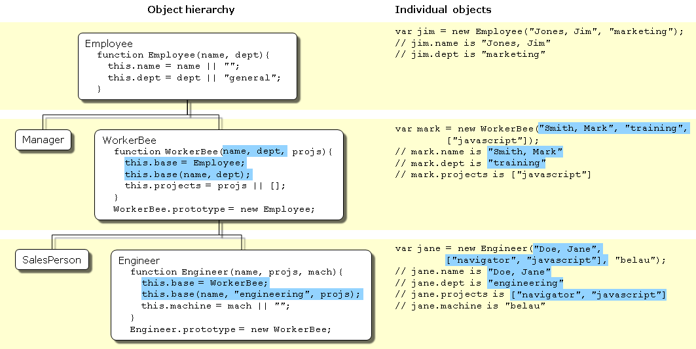

# 基于类vs 基于原型的语言

* 类定义了所有用于具有某一组特征对象的属性（可以将 Java 中的方法和变量以及 C++ 中的成员都视作属性）。类是抽象的事物，而不是其所描述的全部对象中的任何特定的个体。例如 Employee 类可以用来表示所有雇员的集合。

* 另一方面，一个实例是一个类的实例化；也就是其中一名成员。例如， Victoria 可以是 Employee 类的一个实例，表示一个特定的雇员个体。实例具有和其父类完全一致的属性。

> 基于原型的语言js， 并不存在这种区别，它只有对象。

原型对象可以作为一个模板，新的对象可以从中获得原始的属性。
任何对象都可以指定其自身的属性，既可以创建时也可以在运行时创建。
任何对象都可以作为另一个对象的原型，从而允许后者共享前者的属性


## 定义类

在js中，只需要定义而构造函数来创建具有一组特定的出事属性和属性值的对昂。任何js函数都可以用作构造器。

也可以使用new 和构造函数构造新的对象


## 子类和继承

js通过将构造器函数与原型对象相关联的方式来实现集成。


## 差异总结

|基于类的（Java）	|基于原型的（JavaScript）|
|----|----|
|类和实例是不同的事物。	|所有对象均为实例。
|通过类定义来定义类；通过构造器方法来实例化类。	|通过构造器函数来定义和创建一组对象。
|通过 new 操作符创建单个对象。	|相同。
|通过类定义来定义现存类的子类，从而构建对象的层级结构。	|指定一个对象作为原型并且与构造函数一起构建对象的层级结构
|遵循类链继承属性。	|遵循原型链继承属性。
|类定义指定类的所有实例的所有属性。无法在运行时动态添加属性。	|构造器函数或原型指定初始的属性集。允许动态地向单个的对象或者整个对象集中添加或移除属性。


eg:


* Employee 具有 name 属性（默认值为空的字符串）和 dept 属性（默认值为 "general"）。
* Manager 是 Employee的子类。它添加了 reports 属性（默认值为空的数组，以 Employee 对象数组作为它的值）。
* WorkerBee 是 Employee的子类。它添加了 projects 属性（默认值为空的数组，以字符串数组作为它的值）。
* SalesPerson 是 WorkerBee的子类。它添加了 quota 属性（其值默认为 100）。它还重载了 dept 属性值为 "sales"，表明所有的销售人员都属于同一部门。
* Engineer 基于 WorkerBee。它添加了 machine 属性（其值默认为空字符串）同时重载了 dept 属性值为 "engineering"。


```js

function Employee() {
    this.name = "";
    this.dept = "general";
}


// 继承??

function Manager() {
  Employee.call(this);
  this.reports = [];
}
Manager.prototype = Object.create(Employee.prototype);

function WorkerBee() {
  Employee.call(this);
  this.projects = [];
}
WorkerBee.prototype = Object.create(Employee.prototype);

```

在对Engineer 和 SalesPerson 定义时，创建了继承自 WorkerBee 的对象，该对象会进而继承自Employee。这些对象会具有在这个链之上的所有对象的属性。另外，它们在定义时，又重载了继承的 dept 属性值，赋予新的属性值。

```js

function SalesPerson() {
   WorkerBee.call(this);
   this.dept = 'sales';
   this.quota = 100;
}
SalesPerson.prototype = Object.create(WorkerBee.prototype);

function Engineer() {
   WorkerBee.call(this);
   this.dept = 'engineering';
   this.machine = '';
}
Engineer.prototype = Object.create(WorkerBee.prototype);

```

```js

// 括号可以省去，但是一般还是加上

var jim = new Employee; // parentheses can be omitted if the constructor takes no arguments
// jim.name is ''
// jim.dept is 'general'

var sally = new Manager;
// sally.name is ''
// sally.dept is 'general'
// sally.reports is []

var mark = new WorkerBee;
// mark.name is ''
// mark.dept is 'general'
// mark.projects is []

var fred = new SalesPerson;
// fred.name is ''
// fred.dept is 'sales'
// fred.projects is []
// fred.quota is 100

var jane = new Engineer;
// jane.name is ''
// jane.dept is 'engineering'
// jane.projects is []
// jane.machine is ''

```
new 操作符会创建一个通用的对象，并将其作为关键字this的值传递给workbee的构造器函数，并且显示的设值projects属性的值。然后隐世的将内部的prototype属性设值为workbeeprototype的值。内置的prototype属性决定了用于返回属性值的原型链？？ 一旦这些属性设值完成，js返回新创建的对象，然后赋值语句会将变量mark的值指向该对象

这个过程不会显式的将 mark所继承的原型链中的属性值作为本地变量存放在 mark 对象中。当请求属性的值时，JavaScript 将首先检查对象自身中是否存在属性的值，如果有，则返回该值。如果不存在，JavaScript会检查原型链（使用内置的 [[Prototype]] 属性）。如果原型链中的某个对象包含该属性的值，则返回这个值。如果没有找到该属性，JavaScript 则认为对象中不存在该属性。这样，mark 对象中将具有如下的属性和对应的值：

```js

var mark = new WorkBee
mark.name "";
mark.dept = "general";
mark.projects = [];


```

mark 对象从 mark.__proto__ 中保存的原型对象中继承了 name 和 dept 属性的值。并由 WorkerBee 构造器函数为 projects 属性设置了本地值。 这就是 JavaScript 中的属性和属性值的继承。这个过程的一些微妙之处将在 Property inheritance revisited 中进一步讨论


## 更灵活的构造器

```js

function Employee (name, dept) {
  this.name = name || "";
  this.dept = dept || "general";
}

function WorkerBee (projs) {
  this.projects = projs || [];
}
WorkerBee.prototype = new Employee;

function Engineer (mach) {
   this.dept = "engineering";
   this.machine = mach || "";
}
Engineer.prototype = new WorkerBee;


```


js的逻辑或操作符（||） 会对第一个参数进行判断，如果运算结果为真，那么返回该值。否则，返回第二个参数的值

。。。


到目前为止，构造器函数已经能够创建一个普通对象，然后为新对象指定本地的属性和属性值。您还可以通过直接调用原型链上的更高层次对象的构造器函数，让构造器添加更多的属性。下图即实现了这一功能。




假设已经创建了新的engineer 对象

var jane = new Engineer("Doe, Jane", ["navigator", "javascript"], "belau");


1. new 操作符创建了一个新的通用对象，并将其 __proto__ 属性设置为 Engineer.prototype。
2. new 操作符将该新对象作为 this 的值传递给 Engineer 构造器。
3. 构造器为该新对象创建了一个名为 base 的新属性，并指向 WorkerBee 的构造器。这使得 WorkerBee 构造器成为 Engineer 对象的一个方法。base 属性的名称并没有什么特殊性，我们可以使用任何其他合法的名称来代替；base 仅仅是为了贴近它的用意。
4. 构造器调用 base 方法，将传递给该构造器的参数中的两个，作为参数传递给 base 方法，同时还传递一个字符串参数  "engineering"。显式地在构造器中使用 "engineering" 表明所有 Engineer 对象继承的 dept 属性具有相同的值，且该值重载了继承自 Employee 的值。

5. 因为 base 是 Engineer 的一个方法，在调用 base 时，JavaScript 将在步骤 1 中创建的对象绑定给 this 关键字。这样，WorkerBee 函数接着将 "Doe, Jane" 和 "engineering" 参数传递给 Employee 构造器函数。当从 Employee 构造器函数返回时，WorkerBee 函数用剩下的参数设置 projects 属性。

6. 当从 base 方法返回后，Engineer 构造器将对象的 machine 属性初始化为 "belau"。
当从构造器返回时，JavaScript 将新对象赋值给 jane 变量。


???


```js
function Engineer (name, projs, mach) {
  this.base = WorkerBee;
  this.base(name, "engineering", projs);
  this.machine = mach || "";
}
var jane = new Engineer("Doe, Jane", ["navigator", "javascript"], "belau");
Employee.prototype.specialty = "none";

```


jane 不会继承specialty属性，必须显示的设值原型才能确保动态的继承。

```js
function Engineer (name, projs, mach) {
  this.base = WorkerBee;
  this.base(name, "engineering", projs);
  this.machine = mach || "";
}
Engineer.prototype = new WorkerBee;
var jane = new Engineer("Doe, Jane", ["navigator", "javascript"], "belau");
Employee.prototype.specialty = "none";

```

现在 jane 对象的 specialty 属性为 "none" 了。

继承的另一种途径是使用call()\ apply()
下面两种是等价的：

```js
function Engineer(name, projs, mach) {
    this.base = WorkerBee;
    this.base(name, "engineering", projs);
    this.machine = mach || "";
}

or 

function Engineer(nmae, projs, mach) {
    WorkerBee.call(this, name, "enginnering", projs);
    this.machine = mach || "";
}

```


## 再谈属性的继承
在访问对象的属性时，会执行下面的步骤

1. 检查本地是否存在，如果存在，返回该值
2. 如果本地值不存在，检查原型链(__proto__属性)
3. 如果原型链中的某个对象具有指定的属性的值，则返回该值
4. 如果这样的属性不存在，对象没有该属性

再举例：

```js
function Employee () {
  this.name = "";
  this.dept = "general";
}

function WorkerBee () {
  this.projects = [];
}
WorkerBee.prototype = new Employee;

var amy = new WorkerBee;

```

amy 具有一个本地的属性projects, name dept不是amy对象的本地属性
而是从amy对象的 __proto__属性获得的

> 在创建 Employee 对象的任意实例时，该实例的 name 属性将获得一个本地值（空的字符串）。这就意味着在创建一个新的 Employee 对象作为 WorkerBee 的原型时，WorkerBee.prototype 的 name 属性将具有一个本地值。因此，**当 JavaScript 查找 amy 对象（WorkerBee 的实例）的 name 属性时，JavaScript 将找到 WorkerBee.prototype 中的本地值。** 因此，也就不会继续在原型链中向上找到 Employee.prototype 了。

所以，如果想在运行时修改一个对象的属性，并且希望该值被所有的该对象的后代所继承，那么就不能在该对象的构造器函数中定义而该属性！
**而应该将该属性添加到所关联的原型中**

```js
function Employee () {
  this.dept = "general";
}
Employee.prototype.name = ""; // 这一步！！！

function WorkerBee () {
  this.projects = [];
}
WorkerBee.prototype = new Employee;

var amy = new WorkerBee;

Employee.prototype.name = "Unknown";


```
这个属性属于原型的，本地没有，所以amy的name属性会变成unknown


## 构造器中的全局信息 ？？

## 没有多重继承
对象只有一个原型与之管理啊你所以无法动态的从多个原型链中继承


在 JavaScript 中，可以在构造器函数中调用多个其它的构造器函数。这一点造成了多重继承的假象。例如，考虑如下语句：

```js

function Hobbyist (hobby) {
   this.hobby = hobby || "scuba";
}

function Engineer (name, projs, mach, hobby) {
   this.base1 = WorkerBee;
   this.base1(name, "engineering", projs);
   this.base2 = Hobbyist;
   this.base2(hobby);
   this.machine = mach || "";
}
Engineer.prototype = new WorkerBee;

var dennis = new Engineer("Doe, Dennis", ["collabra"], "hugo")


```

dennis.name == "Doe, Dennis"
dennis.dept == "engineering"
dennis.projects == ["collabra"]
dennis.machine == "hugo"
dennis.hobby == "scuba"

dennis 确实从 Hobbyist 构造器中获得了 hobby 属性。但是，假设添加了一个属性到 Hobbyist 构造器的原型：

Hobbyist.prototype.equipment = ["mask", "fins", "regulator", "bcd"]
 
dennis 对象不会继承这个新属性。（因为在创建子类的时候没有先在原型用声明？ 就像上面这一句）


